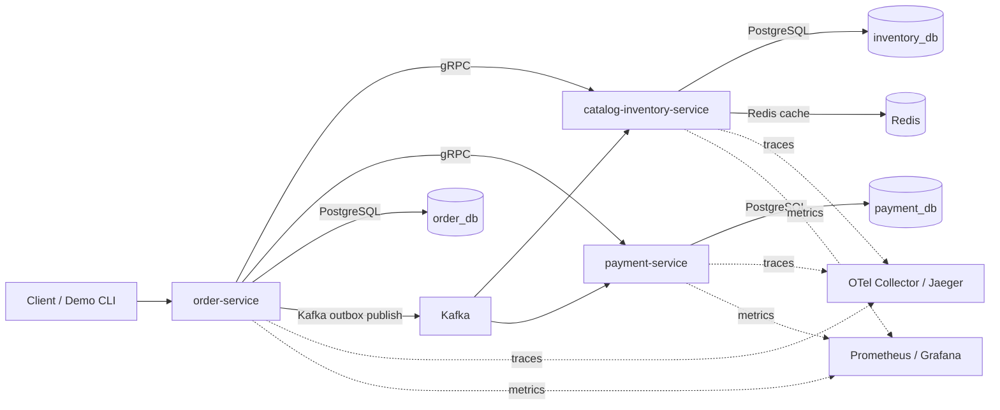

# Go Distributed Toko Bangunan

Demo microservices toko bangunan untuk menunjukkan implementasi:

- Go + Hexagonal Architecture;
- Saga orchestration untuk checkout;
- Kafka outbox/inbox + idempotent consumer;
- gRPC untuk komunikasi sinkron internal;
- PostgreSQL sebagai source of truth;
- Redis sebagai cache non-kritikal;
- OpenTelemetry tracing;
- CI, automated failure scenario test, dan K6 smoke/load test.

Dokumentasi utama tersedia di [doc/README.md](doc/README.md). Urutan implementasi per phase tersedia di [doc/implementation/implementation-phases.md](doc/implementation/implementation-phases.md).

## Gambaran Sistem

Service utama:

- `order-service`
- `catalog-inventory-service`
- `payment-service`

Diagram ringkas:



Flow checkout:

1. client memanggil `POST /orders` ke `order-service`;
2. `order-service` memvalidasi produk dan reserve stock via gRPC ke `catalog-inventory-service`;
3. `order-service` membuat payment via gRPC ke `payment-service`;
4. state transition dan domain event disimpan lewat transaction lokal + outbox;
5. Kafka mendistribusikan event ke service lain;
6. inbox table menjaga idempotency pada duplicate delivery;
7. compensation flow dijalankan saat payment gagal.

## Nilai Portfolio

Project ini sengaja didesain untuk menunjukkan hal yang biasanya dicari saat interview backend/distributed systems:

- pemisahan boundary service yang jelas;
- orchestration Saga dengan compensation;
- outbox/inbox pattern yang benar-benar jalan;
- Kafka consumer retry dengan exponential backoff dan DLQ;
- idempotency untuk HTTP command, gRPC command, dan Kafka consumer;
- distributed tracing lintas REST, gRPC, Kafka, PostgreSQL, dan Redis;
- command-line demo untuk success, failure, duplicate event, dan Redis down;
- K6 smoke/load scenario untuk endpoint utama;
- dokumentasi teknis dan ADR yang bisa dibaca manusia maupun AI.

## Yang Bisa Ditunjukkan Dalam 5 Menit

Jika reviewer hanya memberi waktu singkat, bagian yang paling kuat untuk ditunjukkan adalah:

1. `POST /orders` menjalankan Saga orchestration lintas 3 service.
2. Payment failure memicu compensation dan stock kembali seperti semula.
3. Duplicate Kafka event tidak menggandakan efek bisnis karena inbox/idempotency.
4. Jaeger memperlihatkan trace lintas REST, gRPC, Kafka, PostgreSQL, dan Redis.
5. GitHub Actions menjalankan container stack nyata, bukan hanya unit test.

## Quick Start

Default local environment memakai Podman di Ubuntu.

```bash
make infra-up
make kafka-topics
make up
make inventory-seed
```

`make kafka-topics` membuat topic utama dan topic DLQ:

```text
order.events
inventory.events
payment.events
order.events.dlq
inventory.events.dlq
payment.events.dlq
```

Jika menjalankan service dari terminal lokal untuk debugging:

```bash
make infra-up
make kafka-topics
make inventory-seed
make order-run
make inventory-run
make payment-run
```

Jika menggunakan Docker:

```bash
make infra-up COMPOSE="docker compose"
make up COMPOSE="docker compose"
```

## Demo dan Verifikasi

Trace observability:

```bash
make trace-verify
PAYMENT_MODE=FAILURE make trace-verify
```

Failure scenario end-to-end:

```bash
make test-unit
make test-integration
make test-e2e
make ci-integration COMPOSE="docker compose"
```

Catatan operasional:

- `/healthz` hanya menandakan proses HTTP aktif.
- `/readyz` dipakai untuk startup gate pada CI dan E2E; endpoint ini mengembalikan `503` jika dependency inti belum siap.

K6 smoke/load test:

```bash
make perf-smoke
make perf-load
```

Metrics dashboard:

```bash
make metrics-up
```

Endpoint lokal:

```text
Prometheus: http://localhost:9090
Grafana: http://localhost:3000
Node exporter: http://localhost:9100/metrics
```

Jika memakai Docker sebagai runtime container:

```bash
make perf-smoke CONTAINER=docker
```

Panduan showcase dan checklist artefak portfolio:

- [Panduan Showcase Portfolio](doc/demo/portfolio-showcase.md)
- [Demo Script](doc/demo/demo-script.md)

## CI

Workflow GitHub Actions ada di:

```text
.github/workflows/ci.yml
```

Cakupan CI:

- `make proto-validate`
- `make test-unit`
- `make ci-integration COMPOSE="docker compose"`
- `make build-all`
- docker build untuk tiga service

Run yang sudah membuktikan phase CI ini hijau:

- `26681168668` untuk `5ff6881`
- `26681209486` untuk `45e4571`

Keduanya menjalankan job `test-build`, `integration-e2e`, dan matrix `docker-build`.

## Struktur Penting

```text
services/
  order-service/
  catalog-inventory-service/
  payment-service/
shared/
proto/
tests/performance/k6/
doc/
scripts/
```

## Dokumen Kunci

- [PRD](doc/product/prd.md)
- [System Architecture](doc/architecture/system-architecture.md)
- [Checkout Saga](doc/architecture/checkout-saga.md)
- [Technology Decisions](doc/implementation/technology-decisions.md)
- [Repository Structure](doc/implementation/repository-structure.md)
- [Testing Strategy](doc/testing/testing-strategy.md)
- [Performance Testing K6](doc/testing/performance-testing-k6.md)
- [Panduan Showcase Portfolio](doc/demo/portfolio-showcase.md)
- [Tracing dan Idempotency](doc/observability/tracing-and-idempotency.md)
- [ADR Index](doc/adr/README.md)
- [Handoff Project](doc/handoff.md)

## Tradeoff yang Sengaja Diambil

Beberapa keputusan memang condong ke demo yang kredibel dan murah dijalankan:

- orchestrator checkout masih berada di `order-service`, tetapi boundary-nya disiapkan agar mudah dipisah nanti;
- Kafka single-node dan PostgreSQL single instance dipakai untuk biaya dan kompleksitas lokal yang rendah;
- Redis diposisikan sebagai cache non-kritikal, bukan sumber kebenaran;
- CI container stack dijalankan satu node agar bisa tetap realistis tanpa biaya cloud.
